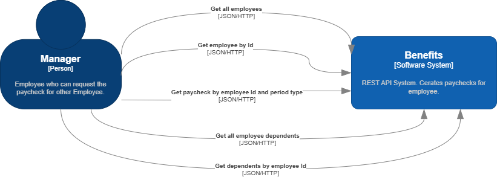

<details>

<summary>Instructions for Coding Assessment 💡</summary>

# What is this? 🤔

A project seed for a C\# dotnet API (`PaylocityBenefitsCalculator`). It is meant to help you start the Paylocity BackEnd Coding Challenge by taking away some initial setup decisions.

The goal is to respect your time, avoid live coding, and get a sense for how you work.

# Coding Challenge

## Show us how you work 🚀

Each of our Paylocity product teams operates like a small startup, empowered to deliver business value in whatever way they see fit. Because our teams are close knit and fast moving, it is imperative that you work collaboratively with your
fellow developers.

This coding challenge is designed to let you demonstrate your abilities and discuss your approach to design and implementation with your potential colleagues. You are free to use whatever technologies you prefer, but please be prepared to
discuss your choices. We encourage you to focus on creating a logical and functional solution rather than one that is completely polished and ready for production.

The challenge acts as a canvas to capture your strengths, reflecting your overall coding standards and approach. There is no right or wrong answer; it’s more about how you think through the problem. We’re looking to see your skills in all
three tiers, making the solution a conversation starter to show your abilities across the board.

## Instructions for Coding Assessment 📝

### How do I get started?

- Create a new GitHub repository, seeded from the provided zip file
- Implement requirements
- Document any decisions with comments explaining _why_
- Provide us with a link to your code repository

### Requirements

- Able to view employees and their dependents 👥
- An employee may only have 1 spouse or domestic partner (not both) — this does not need to be implemented explicitly but can serve to limit your test cases.
- An employee may have an unlimited number of children 👶
- Able to calculate and view a paycheck for an employee given the following rules:
    - 26 paychecks per year with deductions spread as evenly as possible on each paycheck 📆
    - Employees have a base cost of \$1,000 per month (for benefits) 💸
    - Each dependent represents an additional \$600 cost per month ➕
    - Employees that make more than \$80,000 per year will incur an additional 2% of their yearly salary in benefits costs 📊
    - Dependents over 50 years old will incur an additional \$200 per month 🌟

## What are we looking for?

- understanding of business requirements
- correct implementation of requirements
- test coverage for the cost calculations
- code/architecture quality
- plan for future flexibility
- address "task" code comments
- easy to run your code (if non-standard, provide directions)

## What should you not waste time on?

- authentication/authorization
- input sanitization
- logging
- adding multiple projects to represent layers... putting everything in the API project is fine

</details>

# How to run the project

## Prerequisites ✔️

- .NET 6+ SDK (Note: JetBrains IDE won't connect debugger to Test project with .Net6, use .Net8)
- Docker 🐳

## Run project

1. Clone the repository 🔄
2. Open a terminal and navigate to the project directory 💻
3. Run SQL database in a Docker container:
    ```bash
    docker run -e "ACCEPT_EULA=Y" -e "MSSQL_SA_PASSWORD=yourStrong(!)Password" -e "MSSQL_PID=Express" -p 14330:1433 -d mcr.microsoft.com/mssql/server:2019-latest
    ```
4. Build and run the project ⚙️
5. Use the API by Swagger or run integration tests 🧪

# Documentation
# Introduction and Goals

This system is designed to manage employee payroll and benefit deductions using a biweekly pay cycle, where employees receive 26 paychecks per year. The platform supports viewing employees and their dependents, and accurately calculates net
paycheck amounts by applying predefined deduction policies.

## Requirements Overview

### Functional Requirements:

**Requirements:**

- able to view employees and their dependents
- an employee may only have 1 spouse or domestic partner (not both)
    - this does not need to be implemented explicitly, but can serve to limit your test cases
- an employee may have an unlimited number of children
- able to calculate and view a paycheck for an employee given the following rules:
    - 26 paychecks per year with deductions spread as evenly as possible on each paycheck
    - employees have a base cost of $1,000 per month (for benefits)
    - each dependent represents an additional $600 cost per month (for benefits)
    - employees that make more than $80,000 per year will incur an additional 2% of their yearly salary in benefits costs
    - dependents that are over 50 years old will incur an additional $200 per month

**Nice to Have:**

- Support for **Monthly pay period** in paycheck calculation.

**Assumptions:**
- The age-based benefit adjustment for dependents over 50 applies only to the **Spouse or Domestic Partner**.
- Prevent net pay from falling below zero. Deduction is limited to gross pay. Display deductions but show Net Pay as $0.00.
- Paycheck amounts are **rounded to 2 decimal places**.
- Display paycheck with breakdown of deductions.

**Need clarification:**
- Should dependents over 50 years exclusively apply to grandparents for benefits adjustment?

### Non Functional Requirements:

- **Accuracy**  
  Ensure precise calculation of paychecks and benefit deductions, adhering strictly to the defined business rules.

- **Usability**  
  Provide an intuitive user interface for managers to manage employee and dependent information efficiently using REST API.

- **Maintainability**  
  No need adding multiple projects to represent layers... putting everything in the API project is fine

- **Performance**  
  No specific performance optimization requirements.

- **Security**  
  No specific security requirements are defined. Not need to implement authentication or authorization, input sanitization.

- **Reliability**
  No specific reliability requirements are defined. The system is a pet project, and the goal is simply to make it work for development, demonstration, and experimentation purposes.

- **Observability**  
  As this is a simple pet project, observability features such as logging are not implemented. System behavior will be validated primarily through debugging during development.

### Stakeholders

This coding challenge is designed to let you demonstrate your abilities and discuss your approach to design and implementation with your potential colleagues. You are free to use whatever technologies you prefer, but please be prepared to
discuss your choices. We encourage you to focus on creating a logical and functional solution rather than one that is completely polished and ready for production.

## Context and Scope

### Business Context



## Solution Strategy
### STR1 **[Maintainability] Containerization with Docker**
Containerization with Docker is used to host the Web application to ensure consistent behavior across development, testing, and production environments.

### STR10 **[Maintainability] Architecture Selection Aligned with DDD Principles**

The solution adopts Onion Architecture and Domain-Driven Design (DDD) to isolate core business logic from infrastructure concerns. Layers are organized within a single project using folder-based structure, with strict inward-only
dependencies.  
This modular design promotes maintainability, facilitates unit testing, and allows infrastructure or domain changes with minimal impact.  
The architecture was inspired by the Order API service from the official [.NET eShop](https://github.com/dotnet/eShop) sample, replacing commands and handlers with service classes for simplicity.

### STR20 **[Maintainability][Usability] RESTful API Design**

The system exposes a RESTful API using standard HTTP verbs and resource-based URIs (e.g., `/employees/{id}/paycheck`).  
This improves integration clarity, aligns with web standards, and simplifies client development.

### STR21 **[Maintainability] Use of SQL Database with Transactional Integrity**

Transactional support is essential—especially for paycheck generation—as data consistency and durability are critical.
Paychecks must never be lost or partially saved.

### STR22 **[Maintainability] Use of Entity Framework Core for Data Access**

Entity Framework Core (EF Core) is used as the Object-Relational Mapper (ORM) to simplify data access and reduce boilerplate code.  
It enables strongly typed, LINQ-based queries and integrates well with the domain model, allowing the use of projections and tracking where appropriate.  
EF Core also supports migrations, making it easier to evolve the database schema alongside domain changes.

### STR23 **[Maintainability] Direct Use of DbContext Instead of Repository Abstraction**
The application uses `DbContext` and `DbSet` directly for data access, as they already implement the Repository and Unit of Work patterns.  
This avoids redundant abstractions, reduces boilerplate code, and leverages EF Core's built-in capabilities such as change tracking, projections, and query composition.  
Custom repositories may be introduced later if domain-specific logic or decoupling becomes necessary.

### STR30 **[Performance] Use of async/await and CancellationToken**

The application uses `async/await` to enable non-blocking I/O operations, improving scalability and responsiveness of the API under load.  
`CancellationToken` is passed through relevant service and controller layers to support cooperative cancellation, ensuring graceful shutdowns and better resource management during long-running or aborted requests.

### STR40 **[Accuracy] Verified by Automated Testing**

Accuracy is achieved through a combination of unit tests for core domain objects (e.g., benefit policies, paycheck calculator) and end-to-end integration tests of the API.

### STR50 **[Testability] Integration Testing with ASP.NET Core and Testcontainers**

The integration test strategy can be enhanced by adopting the official ASP.NET Core integration testing approach
(https://learn.microsoft.com/en-us/aspnet/core/test/integration-tests?view=aspnetcore-9.0) to host the System Under Test (SUT).
This enables full application testing and debugging within a single process.
External dependencies such as databases can be isolated using Testcontainers (https://testcontainers.com/),
providing a clean, reproducible environment for each test run.
For scenario-based testing, a BDD framework can improve readability and clarity of test cases.
Additionally, each scenario can be linked to a test case ID in a test management tool,
allowing traceability and visibility of test coverage and status during release cycles.

## Architectural Decisions

Design decisions are documented as inline comments within the codebase.
To locate them, search for comments prefixed with `// why?`.

## Glossary

- **Employee**: A person who is employed by the organization and is eligible to receive a salary and benefits.

- **Dependent**: An individual (spouse, domestic partner, or child) who relies on the employee for financial support and is covered under the employee’s benefits.

- **Spouse**: A legally married partner of the employee. Only one spouse or domestic partner is allowed per employee.

- **Domestic Partner**: An unmarried partner of the employee in a long-term relationship. Considered equivalent to a spouse for benefits purposes.

- **Child**: A dependent of the employee under parental or financial care. An employee may have any number of children as dependents.

- **Paycheck**: A payment issued to the employee, which includes salary minus deductions for benefits.

- **Deduction**: The portion of an employee’s paycheck withheld to cover the cost of health and other benefits for the employee and dependents.

- **Deduction Policy**: A business rule that defines how benefit deductions are calculated for an employee on a yearly basis.

- **Salary**: The annual gross income earned by an employee before any benefit deductions are applied. It determines paycheck size and triggers surcharge rules.

- **Salary Threshold**: A benchmark value ($80,000/year) above which an additional 2% of the salary is added to the total benefit cost.

- **Pay Period Type**: The interval at which employees are paid (e.g., monthly, biweekly).

- **Even distribution of deductions**: means that the total annual cost of benefits is divided equally across all 26 pay periods of the year. This ensures that each paycheck has the same deduction amount, making financial planning
  predictable for the employee.
